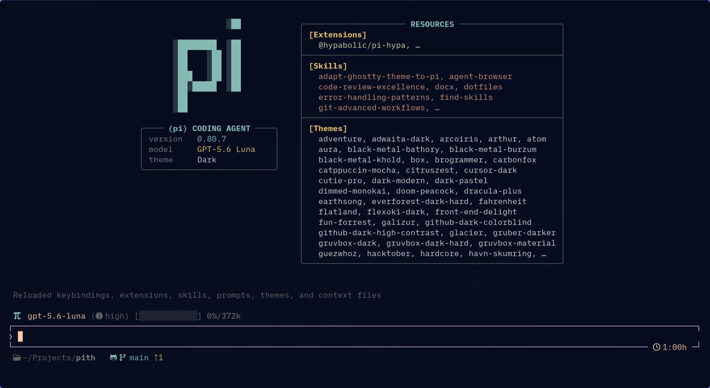
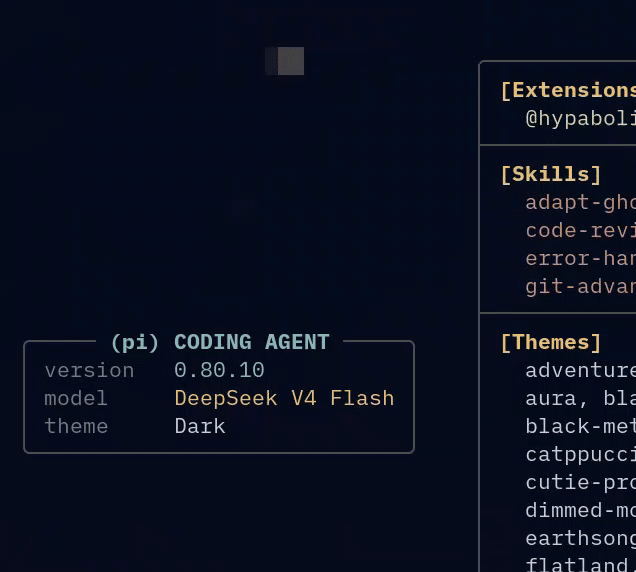
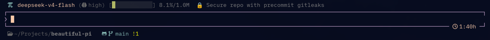

# Beautiful Pi

Beautiful UI extensions and themes for [pi](https://github.com/badlogic/pi-mono), the terminal coding agent.

<div align="center">



[](https://www.npmjs.com/package/beautiful-pi)
[](https://www.npmjs.com/package/beautiful-pi)
[](https://github.com/danielmrdev/beautiful-pi)
[](./LICENSE)

</div>

---

**Features:** 
- Animated startup banner
- Status footer with model, effort, session name, folder, git state and context usage
- Cohesive rail-styled chat layout
- One-line tool output
- Session auto-naming
- OpenAI Codex usage monitor
- OpenCode Go usage monitor
- Two Tokyo Night colour themes
- Custom settings TUI

## Installation

### Prerequisites

- [pi](https://github.com/badlogic/pi-mono) — install it globally
- A [Nerd Font](https://www.nerdfonts.com/) installed and configured in your
  terminal (recommended). The extensions degrade gracefully with ASCII fallbacks.

### Install the package

#### From npm

```bash
pi install beautiful-pi
```

#### From source

```bash
git clone https://github.com/danielmrdev/beautiful-pi.git
cd beautiful-pi
pi install .
```

Then reload pi:

```
/reload
```

### Enable themes

Set a theme in pi:

```
/theme tokyo-night
```

Or from the settings file (`~/.pi/agent/settings.json`):

```json
{
  "theme": "tokyo-night"
}
```

Available themes: `tokyo-night`, `tokyo-night-nord`.

### Included integrations

One `pi install beautiful-pi` enables this curated package catalog automatically;
no second package install is needed. Upstream packages remain normal npm
dependencies, pinned exactly in `package.json`:

| Category | Bundled package | Version | Repo |
| --- | --- | ---: | --- |
| Compaction | `@ogulcancelik/pi-codex-compaction` | 0.1.3 | [repo](https://github.com/ogulcancelik/pi-extensions/tree/main/packages/pi-codex-compaction) |
| Compaction | `pi-blackhole` (fork) | 0.4.3+`4700d7b` | [fork](https://github.com/danielmrdev/pi-blackhole) — [upstream](https://github.com/k0valik/pi-blackhole) |
| Context | `@hypabolic/pi-hypa` | 0.1.12 | [repo](https://github.com/Hypabolic/Hypa/tree/main/packages/pi-hypa) |
| Context | `pi-rtk-optimizer` | 0.9.0 | [repo](https://github.com/MasuRii/pi-rtk-optimizer) |
| Workflows | `@plannotator/pi-extension` | 0.25.1 | [repo](https://github.com/backnotprop/plannotator) |
| Workflows | `@tintinweb/pi-subagents` | 0.14.3 | [repo](https://github.com/tintinweb/pi-subagents) |
| Interaction | `@juicesharp/rpiv-ask-user-question` | 2.4.0 | [repo](https://github.com/juicesharp/rpiv-mono/tree/main/packages/rpiv-ask-user-question) |
| Interaction | `@juicesharp/rpiv-btw` | 2.4.0 | [repo](https://github.com/juicesharp/rpiv-mono/tree/main/packages/rpiv-btw) |
| Themes | `tokyo-night`, `tokyo-night-nord` (bundled themes) | — | [theme docs](#themes) |

`pi-blackhole` is pinned to a temporary provider-aware fork
(`github:danielmrdev/pi-blackhole#4700d7b`, issue #7) while the
`skipForProviders` capability lands upstream
([k0valik/pi-blackhole#47](https://github.com/k0valik/pi-blackhole/pull/47));
switching back to the official release is a one-line dependency bump. See
[`THIRD-PARTY-NOTICES.md`](./THIRD-PARTY-NOTICES.md) for ownership and licenses.

### Provider and compaction commands

beautiful-pi manages multiple Codex subscriptions on top of Pi's built-in
provider auth. Pi owns the OAuth credential store (`~/.pi/agent/auth.json`);
this package never writes it. In an interactive session:

Typing `/codex ` opens the editor autocomplete with the available sections,
subcommands, and existing account/pool/chain/preset refs.

```text
/codex account add <label>   create a new Codex account (e.g. work, personal)
/codex account login [ref]   authenticate the account (run the shown /login)
/codex account logout [ref]  remove the stored credential (run the shown /logout)
/codex account switch [ref]  switch the active model to the account
/codex account list          list accounts with auth status
/codex account status [ref]  detailed status for one account
/codex account quota [ref]   inspect quota windows (5h/7d usage) per account
/codex account remove [ref]  remove the account configuration entry
/codex account migrate       run legacy multi-pass config migration
/codex pool create <name> <member...>   create a pool from account refs
/codex pool list            list pools with members
/codex pool inspect <pool>  per-member eligibility (auth, cooldown, project, strategy)
/codex pool enable <pool>   re-enable a pool
/codex pool disable <pool>  disable a pool (no rotation/failover)
/codex pool delete <pool>   remove the pool
/codex pool add <pool> <member...>      add members
/codex pool remove <pool> <member...>   remove members
/codex pool use <pool>      select a member (round-robin, quota-first, scheduled, or custom)
/codex pool strategy <pool> <round-robin|quota-first|scheduled|custom>
/codex pool schedule <pool> [<HH:MM-HH:MM>,...] [days <spec>] [from <date>] [to <date>] [roles <member>=<role> ...]
/codex pool schedule clear <pool>       remove the schedule
/codex pool selector <pool> <command>   custom member selector (outputs a member ref)
/codex pool selector clear <pool>       remove the selector
/codex chain create <name> <target...>  ordered fallback chain (targets: pool or account refs)
/codex chain list           list chains with targets
/codex chain inspect <chain>  per-target eligibility
/codex chain use <chain>    walk targets (each pool uses its strategy) and activate
/codex chain enable <chain> / disable <chain> / delete <chain>
/codex chain add <chain> <target...> / remove <chain> <target...>
/codex preset create <name> <pool> [model <prefix>]   named routing preset
/codex preset list / inspect <preset>
/codex preset activate <preset>   resolve the best eligible member and switch to it
/codex preset enable <preset> / disable <preset> / delete <preset>
/codex project allow <account...>  restrict this project to the given accounts
/codex project allow all          clear the project account restriction
/codex project pool <name> <member...>   override a global pool's members for this project
/codex project pool enable|disable|clear <name>
/codex project chain <name> <target...>  override a global chain's targets for this project
/codex project chain enable|disable|clear <name>
/codex project show           effective (global + project) config
```

`days <spec>` accepts `everyday | weekdays | weekend | sun,mon,... | mon-fri ranges`;
`roles` pairs a member with `primary|backup` (backups are used when no primary is
eligible). `ref`/`target` matches an account by label, credential id
(`openai-codex`, `openai-codex-2`), or id. Pool strategies: `round-robin`
(rotate to the next eligible member), `quota-first` (healthiest member by quota
headroom, live check on use), `scheduled` (time/day windows with primary/backup
roles), and `custom` (shell selector fed the eligible members on stdin). Chains
define ordered fallback targets across pools and accounts; presets pin a named
pool + optional model prefix; project overrides apply only in trusted projects
(stored in `.pi/beautiful-pi.json`).

`ref` matches an account by label, credential id (`openai-codex`, `openai-codex-2`), or
id. Adding an account registers its provider with Pi's `/login`, so
`/login openai-codex-2` starts the normal OAuth flow; `/logout openai-codex-2`
removes that credential. Accounts are stored under the `accounts` key of
`~/.pi/agent/beautiful-pi.json`; a trusted project can restrict which accounts
are usable via `allowedCredentialIds` in `.pi/beautiful-pi.json`.

Legacy `pi-multi-pass` configuration (global `~/.pi/agent/multi-pass.json` and
project `.pi/multi-pass.json`) migrates automatically on session start: valid
Codex subscriptions become accounts and project `allowedSubs` becomes
`allowedCredentialIds`. A backup (`*.bak-<timestamp>`) is created before the
legacy file is renamed to `*.migrated`; migration is safe to rerun and skips
malformed or unknown entries without touching valid account configuration.

### Pools and rate-limit failover

Pools group accounts for round-robin routing and automatic failover. A pool
rotates through eligible members (authenticated, not cooling down, allowed in
this project); `/codex pool use <name>` activates the pool's next eligible
member and advances the rotation pointer. Membership is ordered — the order
given at `create`/`add` is the rotation order.

When a request fails with a Codex rate limit or quota error and the active
account is a member of an enabled pool, beautiful-pi marks that account as
attempted (per request) and cooling down (default 60s, per pool), switches to
the pool's next eligible member, and re-sends the interrupted request. Each
account is attempted at most once per request; when every member has been
attempted the original error stands. Non-rate-limit failures never trigger
failover. Cooldowns and the per-request replay state live in memory and reset
when Pi restarts.

Pi's own auth commands still work for a single account:

```text
/login openai-codex       configure or refresh Codex OAuth
/logout                   remove credentials saved by /login
```

For scripts or external clients, print the configured OAuth bearer token without
starting a session:

```bash
pi auth print-bearer-token --provider openai-codex --model gpt-5.5
```

`pi auth` reads stored credentials and never accepts them as command-line input.
Use `pi auth --help` for the exact command surface.

Codex native remote compaction is enabled only for `openai-codex` models. It
uses the Codex Responses API, keeps its opaque checkpoint in Pi's native
compaction entry, and fails closed if the remote request fails. Configure it
separately from beautiful-pi settings:

```json
{
  "autoCompact": true,
  "thresholdRatio": 0.9
}
```

Save this at `~/.pi/agent/pi-codex-compaction.json`; project-local
`.pi/pi-codex-compaction.json` takes precedence. `compaction.reserveTokens` in
Pi's `settings.json` still controls Pi's own threshold. Other providers use
Pi's normal lifecycle.

`pi-blackhole` is pinned to a provider-aware fork while the capability lands
upstream (issue #7). Compaction engine selection is coordinated automatically:
Codex models use native Codex compaction (opaque checkpoints preserved), every
other model uses Blackhole, exactly one engine acts per turn, and the selection
is independent of extension registration order. On session start the
coordinator appends `"skipForProviders": ["openai-codex"]` to
`~/.pi/agent/pi-blackhole/pi-blackhole-config.json`, so Blackhole steps aside
for Codex sessions (no compaction, no observational-memory consolidation). The
fork adds the `skipForProviders` config (file or
`PI_BLACKHOLE_SKIP_PROVIDERS` env var); once the focused upstream PR merges,
switching back to the official release is a one-line dependency bump with no
code changes. The coordinator warns once per session when the guarantee could
degrade: config write failure, `PI_BLACKHOLE_SKIP_PROVIDERS` set without
`openai-codex` (env shadows the file), or an installed pi-blackhole without
the fork capability. The `/blackhole-memory` and `/blackhole-recall` commands
remain available when Blackhole is loaded.

### Configuration entry points

| Path or command | Purpose |
| --- | --- |
| `~/.pi/agent/settings.json` | Pi settings and active theme |
| `~/.pi/agent/beautiful-pi.json` | beautiful-pi feature and rail overrides |
| `~/.pi/agent/pi-codex-compaction.json` | Codex native compaction |
| `.pi/pi-codex-compaction.json` | Project override for Codex compaction |
| `~/.pi/agent/pi-blackhole/pi-blackhole-config.json` | Blackhole compaction and memory |
| `/beautiful-pi` or `/bpi` | Open beautiful-pi settings TUI |
| `/reload` | Reload package resources after config changes |

---

## Features

### Animated startup banner



On session start, beautiful-pi displays a fullscreen banner with:

- **Left column:** Large π ASCII art with per-character fade-in animation, plus
  agent info card (pi version, model, active theme).
- **Right column:** Resource listing — all loaded extensions, skills, and themes.

The banner auto-hides on first input.

**Toggle:** `showBanner` setting (default: `on`).

---

### Status footer



A two-line widget that replaces the default pi footer:

#### Above the editor — stats bar

Shows model, thinking level, context usage (bar + percentage) and the session title.

#### Below the editor — cwd + git state + quota

- Current directory (with `~` for home, smart truncation)
- Git branch, ahead/behind, staged/modified/untracked counts
- OpenAI Codex rate-limit usage (5h + 7d windows) — shown when using an OpenAI
  Codex model
- OpenCode Go subscription usage (5h, 7d, 30d tiers) — shown when using an
  OpenCode Go model. Requires `opencodeGoWorkspaceId` + `opencodeGoAuthCookie`
  in `beautiful-pi.json`

**Toggle:** `showFooter` setting (default: `on`).

---

### Rail-styled chat messages

All message types render with a consistent left rail (`┃`) and controlled
indentation:

#### Agent messages

- **Text blocks:** no left rail, clean background (or default terminal bg)
- **Thinking blocks:** coloured `┃` rail with italic content (colour controlled
  by `thinkingRailColor` setting)
- **Error/stop reasons:** shown in `error` colour

#### User messages

- Coloured `┃` rail on the left (colour controlled by `userRailColor` setting)

#### Tool execution

When `toolsOneLine` is enabled (`on` by default), each tool call renders as a
single compact line:

```text
    ┃ spinner  cmd — npm install express
    ┃ ✓        Read  ~/config/app.ts:10–30
    ┃ ✓        Grep  "middleware"  src/  (*.ts)
    ┃ ✓        Edit  ~/config/app.ts
```

- Spinning dots during execution (disappears when done)
- Green `✓` on success, red `✕` on error
- Colour and dimness controlled by `toolRailColor` and `dimToolsText` settings
- Unregistered tools (MCP, web search, etc.) get the same treatment via a
  generic patch

#### Custom messages (web search results, skill output, etc.)

```text
    ┃ Web Search Results
    ┃ Title: Finding the answer
    ┃ URL: https://example.com
```

Colour controlled by `customMessageRailColor` and `dimCustomMessages` settings.

---

### Session auto-title

On first user input in a new session, beautiful-pi sends a lightweight LLM call
to generate a concise emoji title (e.g. `✨ Add dark mode toggle`). The title
appears in:

- The session selector sidebar
- The terminal tab title
- The stats bar (above editor)

Falls back to simple truncation if the LLM call fails. The feature is
configurable via `sessionTitle` setting (default: `on`).

---

### /beautiful-pi command

Opens a TUI settings panel where you can toggle all features and pick rail
colours:

```
╭───  beautiful-pi settings ────────────────────────────────╮
│                                                           │
│  > Banner                        on                       │
│    Footer                        on                       │
│    Session title                 on                       │
│    Tools one-line                on                       │
│    Indent level                  4                        │
│                                                           │
│    Agent rail color              accent                   │
│    User rail color               mdLink                   │
│    Thinking rail color           mdHeading                │
│    Dim thinking text             on                       │
│    Tools rail color              success                  │
│    Dim tools text                on                       │
│    Custom rail color             borderMuted              │
│    Dim custom messages           on                       │
│                                                           │
╰──  ↑↓ navigate  Space/Enter change  Esc close  ───────────╯
```

Changes persist to `~/.pi/agent/beautiful-pi.json`. Run `/reload` after
changing toggles or colours.

---

### Editor border

The editor gets a custom border treatment:

- Content lines prefixed with `❯`
- Bottom border shows a session timer in the right corner:
  ```
  └────────────────────────────────────────────────────────── ◷ 42m ─┘
  ```
- The top border is removed so the stats bar merges seamlessly into the editor

---

## Settings reference

All settings are stored in `~/.pi/agent/beautiful-pi.json`. Only values that
differ from defaults are persisted. Delete the file to reset everything.

| Setting | Type | Default | Description |
|---|---|---|---|
| `showBanner` | boolean | `true` | Show animated startup banner |
| `showFooter` | boolean | `true` | Show stats bar + footer |
| `sessionTitle` | boolean | `true` | Auto-generate session titles |
| `toolsOneLine` | boolean | `true` | Compact one-line tool output |
| `indentLevel` | integer | `4` | Rail indentation (spaces) |
| `agentRailColor` | string | `"accent"` | Agent thinking rail colour token |
| `userRailColor` | string | `"mdLink"` | User message rail colour token |
| `thinkingRailColor` | string | `"mdHeading"` | Thinking block rail colour token |
| `thinkingTextColor` | string | `"muted"` | Thinking text colour token |
| `dimThinkingText` | boolean | `true` | Dim thinking text |
| `toolRailColor` | string | `"success"` | Tool execution rail colour token |
| `dimToolsText` | boolean | `true` | Dim completed tool labels |
| `customMessageRailColor` | string | `"borderMuted"` | Custom message rail colour token |
| `dimCustomMessages` | boolean | `true` | Dim custom message text |

Colour tokens reference the active theme's semantic colour map. Available
tokens: `accent`, `border`, `borderAccent`, `borderMuted`, `muted`, `dim`,
`text`, `thinkingText`, `success`, `error`, `warning`, `syntaxKeyword`,
`syntaxFunction`, `syntaxString`, `syntaxType`, `mdHeading`, `mdLink`,
`mdCode`, `customMessageLabel`, `toolTitle`.

---

## Themes

### Tokyo Night

A faithful adaptation of the classic [Tokyo Night](https://github.com/folke/tokyonight.nvim)
colour palette for pi. Deep blue-grey background (`#1a1b26`) with vibrant accent
colours.

### Tokyo Night Nord

A hybrid theme that blends Tokyo Night's syntax colours with a Nord-like cooler
palette. Uses a slightly lighter accent set while keeping the same deep
background.

---

## Publishing

Run release checks before publishing:

```bash
pnpm typecheck     # TypeScript checks
pnpm test          # complete automated suite
pnpm pack:check    # inspect tarball contents
```

The tarball must contain runtime extensions, themes, assets, README, license,
`CHANGELOG.md`, and `THIRD-PARTY-NOTICES.md`; it must not depend on a bundled
`node_modules/` directory. A clean install should resolve the exact dependency
versions from `package.json`, then load every explicit manifest resource in a
TUI-capable Pi process with `PI_OFFLINE=1`. This smoke test needs no OAuth,
Codex, quota, or network credentials; provider requests are not part of release
verification.

```bash
pnpm publish --access public  # requires npm account with 2FA
```

After npm publication, submit the package to the [pi.dev gallery](https://pi.dev/packages) using the npm package name and the public image URL declared in the package manifest. The gallery automatically detects `pi-package` keyword packages.

---

## Extension architecture

```
extensions/
├── index.ts                    # Entry point — wires all extensions
├── shared/
│   ├── icons.ts                # Nerd Fonts detection, icon sets, strWidth()
│   └── settings.ts             # Settings loader, safe colour helpers, tests
├── settings/
│   └── index.ts                # `/beautiful-pi` command (SettingsList TUI)
├── banner/
│   └── index.ts                # Startup banner (aboveEditor header)
├── footer/
│   ├── index.ts                # Stats bar + footer widgets
│   ├── borderless-top-editor.ts# Custom editor with ❯ prefix + timer
│   └── openai-usage.ts         # OpenAI Codex quota fetcher/parser
│   └── opencode-go-usage.ts    # OpenCode Go quota fetcher/parser
├── assistant-style/
│   └── index.ts                # Agent message rail style
├── user-style/
│   └── index.ts                # User message rail style
├── custom-message/
│   └── index.ts                # Custom message rail style
├── session-title/
│   └── index.ts                # Auto-title generation
└── tools-one-line/
    ├── index.ts                # Tools wire-up
    ├── shared.ts               # OneLine component, spinner, registerTool helpers
    ├── register-bash.ts        # Bash tool label
    ├── register-read.ts        # Read tool label
    ├── register-write.ts       # Write tool label
    ├── register-edit.ts        # Edit tool label
    ├── register-grep.ts        # Grep tool label
    ├── register-find.ts        # Find tool label
    ├── register-ls.ts          # Ls tool label
    └── register-generic.ts     # Generic tool rail patch (MCP, unregistered tools)
```

---

## Security

This project includes a pre-commit hook that scans staged changes for secrets
using [gitleaks](https://github.com/gitleaks/gitleaks). Set it up:

```bash
git config core.hooksPath .githooks
```

You can also run it manually:

```bash
pnpm gitleaks:scan     # full repo scan
pnpm gitleaks:staged   # scan staged changes only
```

---

## Development

See [CONTRIBUTING.md](./CONTRIBUTING.md) for workflow, conventions, and
contribution guidelines.

## License

MIT — see [LICENSE](./LICENSE).
